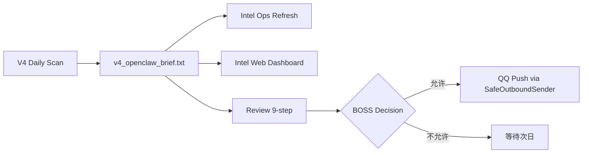

# V4 每日一次只读扫描命令草案

> 状态：DRAFT_ONLY
> 禁止：未经 BOSS 运行时确认不得执行

---

## 扫描命令

```bash
# V4 Daily Scan — 每日只读一次
# 推荐窗口：12:00–14:00 CST

python3 engine/v4_scan_and_brief.py \
  --date YYYY-MM-DD \
  --review-only \
  --no-push \
  --no-state-write \
  --no-verified-write \
  --no-cron
```

## 参数说明

| 参数 | 含义 |
|:---|:---|
| `--date YYYY-MM-DD` | 扫描日期 |
| `--review-only` | 只读扫描，不写入正式文件 |
| `--no-push` | 不推送 QQ |
| `--no-state-write` | 不写 state 文件 |
| `--no-verified-write` | 不写 verified 文件 |
| `--no-cron` | 不触发 cron 任务 |

## 输出

- `v4_openclaw_brief_YYYYMMDD.txt` — 正文版简报
- `v4_openclaw_brief_qq_YYYYMMDD.txt` — QQ 版简报（仅预览）

## 扫描后流程



## 执行前提

1. ✅ CODE_READY
2. ✅ PRODUCTION_VERIFIED=false
3. ✅ Phase E=false
4. ✅ QQ=false
5. ✅ state=false
6. ✅ verified=false
7. ✅ cron=false
8. ⏳ BOSS 运行时确认（**必须**）

## 合规标记

```
COMMAND_DRAFT_ONLY=true
MUST_NOT_EXECUTE_WITHOUT_BOSS_RUNTIME_CONFIRMATION=true
```
